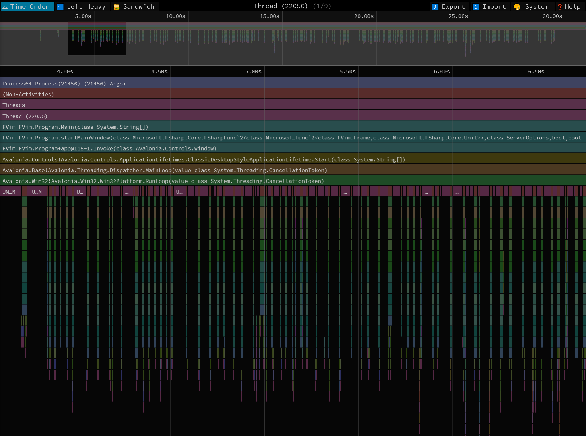
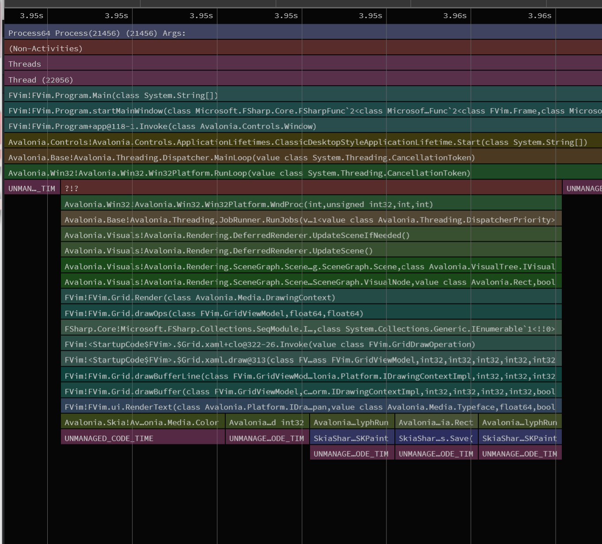
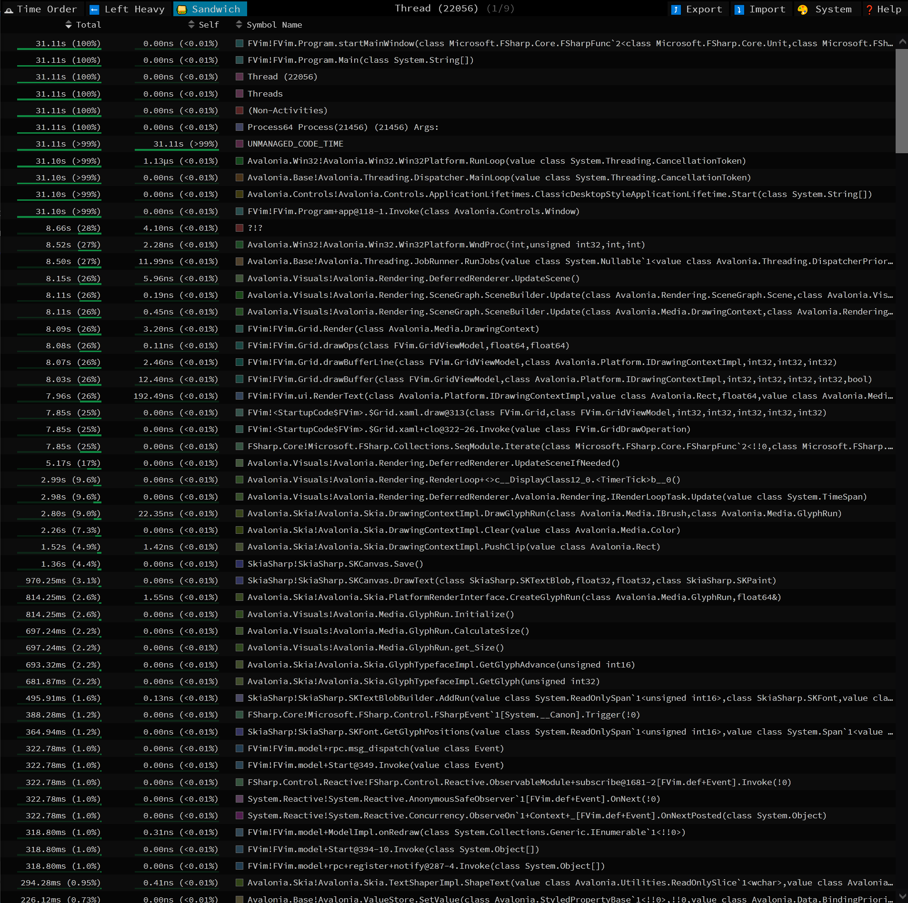
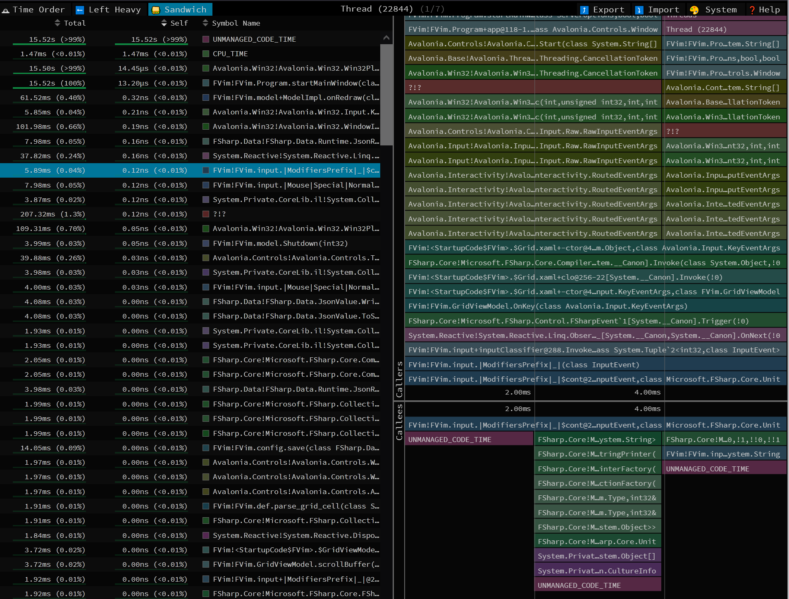
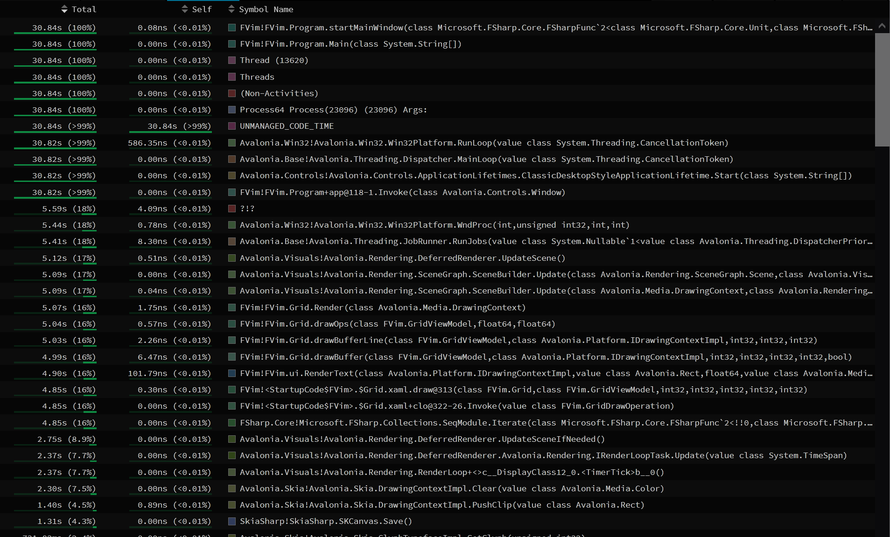
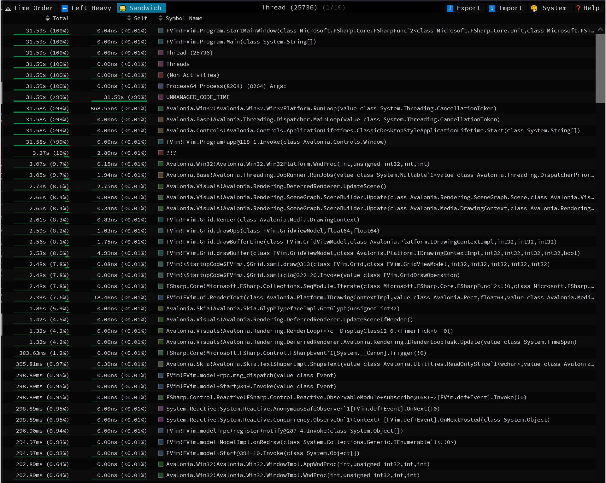

# FVim Profiling 20210920

Setup: fire up Release mode build, load `fvim` session with Startify.
The file `model.fs` will be shown. `gg` and `:e` so that the language server is on, and buffer rewind to the first line.
Then start profiling: `dotnet-trace collect -n FVim --format speedscope`
Press `j` to scroll through the whole buffer. The progress is shown in the scroll bar if no text is shown :)

### Overview

Several runs are conducted:
- 015126: `Grid.Render()` is skipped
- 020847: A "full run"
- 022906: `ctx.DrawGlyphRun` disabled in `ui.RenderText`
- 023521: `ctx.Clear`, `ctx.PushClip`, `ctx.PopClip` and `ctx.DrawGlyphRun` disabled in `ui.RenderText`

### Caveats

- `dotnet-trace` by default conducts cpu sampling, which means that the timing precision is limited, and not all traces are captured.
- The max resolution seems to be ~2ms -- if you see a flame graph stack this wide, it means the stack trace is sampled once, nothing more.

### Analysis

A typical full run looks like this:

The "needles" in the graph are mostly drawBuffer, costing 10-30ms each.
A closer look into one "needle":

Which consists of calls into DrawContextImpl.Clear(Color), PushClip(),
DrawGlyphRun(), GlyphTypefaceImpl.GetGlyph etc.
Flamegraph be like:

Skipping `Grid.Render()`: most time-consuming calls are gone. FVim.input is
still sampled here and there so perhaps it's more heavy than the other stuff.

Disabling DrawGlyphRun():

Time cost for Clear, PushClip etc. are not impacted. Still there.

Further disabling Clear, PushClip:

Costly functions left = GetGlyph
